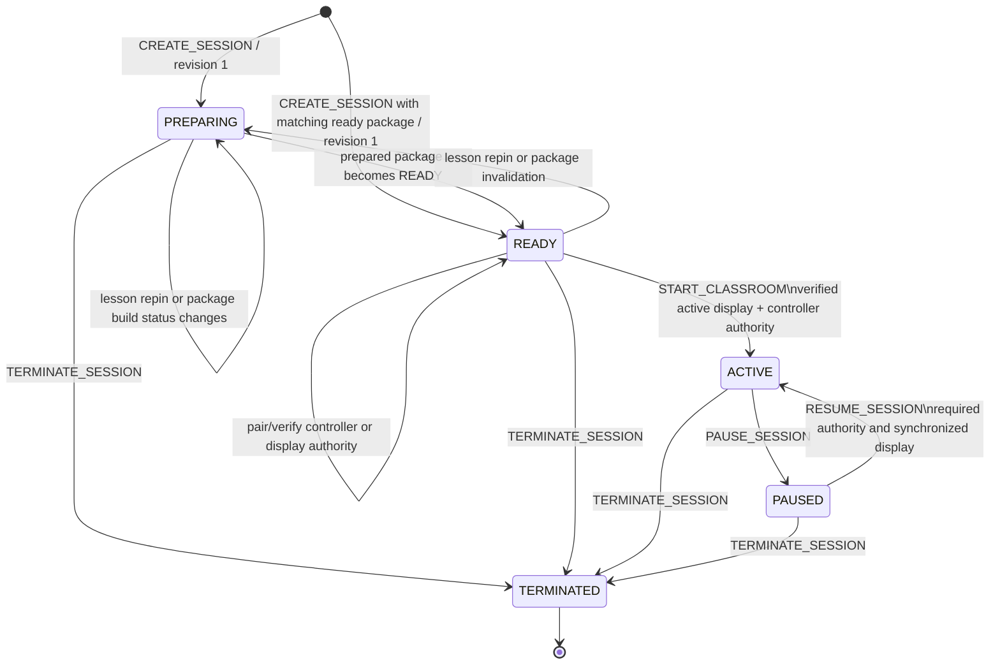

# Pedago Architecture Specification V0.2

## Authoritative Classroom Session Lifecycle & State Machine

**STATUS: PROPOSED — REQUIRES ARCHITECTURE APPROVAL**
**Date: September 4, 2026**
**Supersedes:** None
**Depends on:** [Pedago System Architecture V0.1](v0.1-system-architecture.md)

## 1. Purpose

This specification defines the authoritative classroom-session lifecycle, its valid and invalid transitions, command acceptance semantics, device authority, revision and display-epoch behavior, degraded-connectivity operation, recovery, and interactions with AI generation and teacher approval.

It refines Pedago System Architecture V0.1 without selecting implementation technologies. The ten Conditions of Approval in V0.1 remain mandatory architectural invariants and take precedence if this document is interpreted ambiguously.

This document does not define:

- frontend, backend, persistence, realtime, task-processing, AI-provider, container, cloud, or deployment technologies;
- framework manifests or production code;
- exact user-interface design;
- exact retention durations or commercial policy;
- a general multi-user collaborative document model;
- cold-start offline classroom creation.

## 2. Normative Language

The terms **MUST**, **MUST NOT**, **REQUIRED**, **SHOULD**, **SHOULD NOT**, and **MAY** are normative.

The backend authoritative session core is called the **Session Core**. A **canonical mutation** is a successful command that changes canonical session state. A **projection** is a role-specific view independently derived from canonical state.

## 3. Authoritative Inputs and Invariants

This specification is constrained by:

1. all locked documents under `docs/product-discovery/`;
2. Pedago System Architecture V0.1;
3. the ten Conditions of Approval in V0.1.

The following V0.1 architecture invariants are restated because every lifecycle rule depends on them:

1. The backend is the sole authority for classroom-session state.
2. Every revision-producing command atomically commits one complete snapshot and one ordered journal entry.
3. Canonical revisions are monotonic and commands are idempotent.
4. At most one display has mutation authority, fenced by a monotonic display epoch.
5. All boundaries use versioned structured contracts; arbitrary AI-generated executable content is prohibited.
6. AI candidates remain private until complete, validated, and atomically published.
7. Learner-visible deterministic mathematics must pass deterministic validation.
8. Curriculum-sensitive behavior uses pinned controlled curriculum data.
9. Classroom start requires a verified prepared-lesson package; degraded actions are narrowly allowlisted and reconciled safely.
10. Teacher-private, learner-visible, and system-only state are independently projected.

## 4. State Model Overview

Pedago MUST NOT encode all behavior in one flat status enum. The session model has five orthogonal state dimensions:

| Dimension | Authority | Purpose |
|---|---|---|
| Session lifecycle | Canonical | Preparation, classroom activity, pause, and termination |
| Prepared-package readiness | Canonical | Whether the pinned lesson has a complete verified package |
| Controller authority | Canonical authority; connection presence is operational | Which teacher controller may mutate the session |
| Display authority | Canonical authority plus monotonic epoch; connection presence is operational | Which classroom display may mutate or reconcile |
| AI workflow | Canonical workflow references; transient progress is operational | Pending generation, validation, approval, publication, and terminal outcomes |

Connectivity state is observed independently by each client. A client being offline is not itself proof that the canonical session changed state. Transport connections, heartbeats, retry counters, and progress percentages MUST NOT be treated as canonical classroom state.

## 5. Canonical Session Lifecycle

### 5.1 Lifecycle States

The canonical `lifecycle_state` enum is:

| State | Meaning | Public classroom mutation |
|---|---|---|
| `PREPARING` | Lesson preparation or package preparation is incomplete or invalidated | Not permitted |
| `READY` | The pinned lesson version has a complete prepared package ready for display verification | Not permitted except display authority setup |
| `ACTIVE` | Classroom teaching is in progress | Permitted subject to command rules |
| `PAUSED` | Classroom state is retained but teaching mutations and AI publication are suspended | Not permitted except explicitly allowed recovery and lifecycle commands |
| `TERMINATED` | The session is permanently closed and immutable except for separately governed retention processing | Not permitted |

`PAIRING`, `GENERATING`, `PENDING_APPROVAL`, `OFFLINE`, and `RECOVERING` are not lifecycle states. They belong to separate state dimensions.

### 5.2 State Machine Diagram

### 5.3 Transition Table

| Current lifecycle | Command or condition | Required guards | Result lifecycle | Revision behavior |
|---|---|---|---|---|
| None | `CREATE_SESSION` | Authorized teacher, valid class/lesson/curriculum binding, valid idempotency | `PREPARING`, or `READY` when an exact matching package is already authoritatively ready | Creates revision `1` |
| `PREPARING` | Preparation mutation or package status update not yet ready | Current controller authority, matching revision, immutable-version rules | `PREPARING` | One revision when canonical state changes |
| `PREPARING` | Package becomes authoritatively ready | Exact lesson/curriculum/contracts, integrity and validation complete | `READY` | One revision |
| `READY` | Lesson repin or package invalidation | Preparation authority, matching revision | `PREPARING` | One revision |
| `READY` | Controller/display authority setup that preserves readiness | Authority, package, epoch, and revision rules | `READY` | One revision when authority changes; no revision for defined no-op |
| `READY` | `START_CLASSROOM` | Current controller, active verified display, ready package, valid initial scene | `ACTIVE` | One revision |
| `ACTIVE` | Accepted teaching, navigation, reveal, annotation, workflow, authority, or reconciliation mutation | Command-specific guards | `ACTIVE` | One revision per canonical mutation |
| `ACTIVE` | `PAUSE_SESSION` | Current controller, online command, matching revision | `PAUSED` | One revision |
| `PAUSED` | Authority or recovery mutation allowed by pause policy | No learner-facing mutation, command-specific guards | `PAUSED` | One revision when canonical state changes |
| `PAUSED` | `RESUME_SESSION` | Current controller, active synchronized verified display, matching revision | `ACTIVE` | One revision |
| Any nonterminal state | `TERMINATE_SESSION` | Authorized online termination, matching revision | `TERMINATED` | One revision |
| `TERMINATED` | Any mutation | None; terminal state is immutable | `TERMINATED` | Rejected; no revision |

### 5.4 State Definitions

#### `PREPARING`

- The session exists and has revision `1` or greater.
- It pins a controlled curriculum version.
- It references an immutable lesson version, but preparation MAY create a new immutable lesson version and atomically repin the session before classroom start.
- Repinning the lesson invalidates any package built for the previous lesson version.
- AI preparation workflows MAY run.
- No display may publish learner-facing session changes.
- Display pairing MAY be initiated, but display activation for classroom use requires verification against the current prepared package.

#### `READY`

- The prepared package status is `READY` for the exact pinned lesson and curriculum versions.
- The package has passed integrity, schema, renderer-compatibility, and required curriculum/math checks.
- The session may wait indefinitely for controller attachment, display pairing, package transfer, or explicit classroom start.
- Editing or repinning the lesson transitions the session back to `PREPARING` and invalidates prior display verification.

#### `ACTIVE`

- Entry into `ACTIVE` requires an authorized controller, one active display authority, and verification that the display possesses a compatible copy of the exact current prepared package.
- A later security revocation or device failure MAY temporarily leave the session `ACTIVE` without a writable display; public-scene mutations are then blocked until a display is safely activated or the session is paused or terminated.
- While an active display exists, its epoch is greater than `0` and only that epoch may carry display mutation authority.
- Teaching, navigation, reveal, annotation, assessment requests, and live AI commands MAY be accepted according to role, connectivity, visibility, validation, revision, and idempotency rules.
- The last complete valid public scene remains visible while AI work is pending.

#### `PAUSED`

- The canonical classroom snapshot, current public scene, annotations, lesson position, and reveal state are retained.
- New public-scene mutations, offline provisional mutation, AI publication, and ordinary teaching commands are rejected.
- Reconnection, snapshot reads, same-display recovery, controller recovery, explicit resume, explicit termination, and security-driven authority revocation remain permitted.
- An already running AI workflow MAY finish private generation and validation, but it MUST NOT publish while paused.
- The learner-visible presentation during pause requires product approval; see `Decisions Requiring Product Approval`.

#### `TERMINATED`

- The termination timestamp, reason, final revision, final scene reference, and governed recovery/retention references are fixed.
- Active controller and display mutation authority are revoked or fenced as part of the termination commit.
- Pending pairing, AI, approval, and reconciliation work is invalidated.
- Late commands and asynchronous results cannot mutate the session.
- A terminated session cannot resume. Continuing teaching requires creation of a new session that explicitly references an approved lesson or recovery source.

## 6. Prepared-Lesson Readiness

### 6.1 Readiness States

The canonical `prepared_package_status` enum is:

| State | Meaning |
|---|---|
| `ABSENT` | No package exists for the current pinned lesson version |
| `BUILDING` | Package construction or validation is in progress |
| `READY` | A complete immutable package exists and has passed all required checks |
| `FAILED` | Construction or required validation failed |
| `INVALIDATED` | A former package no longer matches the pinned lesson, curriculum, or required contract versions |

Transient download progress and client cache progress are operational, not canonical readiness states.

### 6.2 Package Identity

A prepared package MUST be bound to at least:

- package identity and integrity digest;
- lesson identity and immutable lesson version;
- pinned curriculum identity and version;
- supported TeachingScene and related contract versions;
- renderer capability requirements;
- included prepared scenes and stable scene identities;
- included question packages, hints, answers, solution steps, and structured visuals;
- required validation and provenance evidence;
- package creation and expiry or invalidation metadata, when policy requires it.

The package MUST NOT contain credentials, pairing secrets, raw audio, teacher-private AI material, or arbitrary executable markup.

### 6.3 Readiness Rules

- `PREPARING → READY` occurs only when package status becomes `READY` for the current pins.
- A package failure keeps or returns the session to `PREPARING`; the last failure is visible privately to the teacher.
- A lesson repin atomically changes the lesson reference, marks the prior package `INVALIDATED`, clears display verification for that package, and leaves or returns the lifecycle to `PREPARING`.
- Classroom start MUST fail closed if package readiness or display verification is missing, stale, incompatible, or unverifiable.
- Cached package verification is per display authority. Package readiness at the backend does not prove that a specific display possesses a valid local copy.

## 7. Session Creation

`CREATE_SESSION` creates the first canonical snapshot at revision `1`.

The command MUST establish:

- a new opaque session identity;
- teacher owner identity and authorized class context;
- a versioned controller-authority lineage for the creating controller;
- a pinned controlled curriculum version;
- a referenced immutable lesson version or initial preparation artifact;
- initial lifecycle `PREPARING` unless a matching package is already authoritatively `READY`;
- package readiness metadata;
- `display_epoch = 0` and no active display;
- AI workflow state `IDLE`;
- no pending approval;
- lifecycle creation timestamp;
- the contract versions used by the initial snapshot.

Creation MUST be idempotent. An exact retry returns the original session identity and revision. A reused creation idempotency identity with changed class, lesson, curriculum, owner, or contract binding fails with `IDEMPOTENCY_CONFLICT`.

Creation MUST NOT:

- activate a display implicitly;
- infer a curriculum version from uncontrolled model memory;
- persist raw push-to-talk audio;
- expose teacher-private preparation output to a display;
- start a classroom before prepared-package and display-verification requirements are met.

## 8. Preparation to Classroom Transition

`START_CLASSROOM` is the only normal transition from `READY` to `ACTIVE`.

It MUST require:

1. lifecycle is `READY`;
2. package status is `READY` for the pinned lesson and curriculum versions;
3. an authorized controller holds current mutation authority;
4. an active display authority exists at the current epoch;
5. the active display has verified the exact package identity and supported contracts;
6. the starting public scene is complete, renderer-compatible, and validated;
7. no unresolved replacement cutover is in progress;
8. the command expected revision equals the current revision;
9. the command is authorized, unexpired, and idempotently valid.

The transition is one canonical mutation and increments revision exactly once. Display pairing, package download, cache verification, and challenge exchange are not implicitly bundled into classroom start.

Failure of any precondition preserves `READY` and creates no canonical revision unless a separate canonical authority or readiness command was independently accepted.

After entering `ACTIVE`, lesson and curriculum pins MUST NOT change. A change requires termination and a new session or a later approved superseding architecture decision.

## 9. Controller Attachment, Detachment, and Recovery

### 9.1 Authority Versus Connection

Controller authority is canonical. Network connection presence is operational.

- Browser backgrounding, transport loss, browser closure, or device sleep does not detach authority, pause the session, terminate the session, or increment revision.
- Reconnecting with the same valid controller authority lineage restores the controller projection through full snapshot resynchronization and creates no revision.
- An unknown command outcome MUST be retried with the original idempotency identity.

### 9.2 Attachment

For MVP, at most one controller has mutation authority.

Controller attachment or takeover MUST:

- authenticate the teacher;
- authorize the teacher for the session;
- bind a new controller authority identity or lineage;
- fence any prior controller mutation authority before the new controller may mutate;
- atomically update canonical authority metadata;
- increment revision exactly once when authority changes.

Attaching the already-authoritative controller is a defined no-op if no canonical field changes.

### 9.3 Detachment

Intentional `DETACH_CONTROLLER` or security revocation differs from temporary disconnection.

- Detachment revokes current controller mutation authority and increments revision once.
- The display remains active and continues showing the last safe public scene.
- An `ACTIVE` session without a controller remains `ACTIVE`; it does not stop automatically.
- Until a controller is reattached, controller-originated mutations, approval, pause, resume, termination, and display replacement are unavailable.
- Display-local online or provisional commands remain governed by display authority and lifecycle rules.

The user experience and authentication proof for controller takeover require product approval; see `Decisions Requiring Product Approval`.

## 10. Display Pairing and Activation

### 10.1 Pairing Challenge

Pairing uses a short-lived, session-scoped, role-scoped, one-use, replay-resistant challenge with teacher confirmation. QR and numeric-code presentation are supported product mechanisms. Numeric attempts MUST be rate-limited.

Pairing challenge data is operational security state and MUST NOT enter:

- canonical snapshots;
- command journals;
- prepared packages;
- ordinary logs;
- learner-visible projections.

Challenge creation and failed attempts do not create session revisions.

### 10.2 Candidate Display

A successfully challenged display becomes a read-only candidate. Candidate status alone grants no mutation authority.

The candidate MUST:

- prove session and role binding;
- declare supported contract and renderer capabilities;
- obtain or verify the exact current prepared package;
- validate package integrity away from the visible renderer;
- obtain a full public snapshot;
- prove readiness for atomic activation or replacement.

Candidate preparation timeout or failure leaves current authority unchanged and creates no session revision unless separately recorded canonical metadata changes.

### 10.3 Initial Display Activation

When no display has ever been activated:

- canonical `display_epoch` is `0`;
- successful activation sets `display_epoch` to `1`;
- the candidate becomes the sole active writable display;
- package verification metadata is bound to that display authority;
- activation commits atomically and increments session revision once.

Initial activation MAY occur in `READY`. It MUST NOT make the lifecycle `ACTIVE` without a separate accepted `START_CLASSROOM` command.

## 11. Display Replacement and Revocation

### 11.1 Two-Phase Replacement

Display replacement is a two-phase protocol:

1. **Prepare candidate:** pair read-only, validate contracts, verify the exact package, fetch and validate the current public snapshot, and report readiness.
2. **Atomic cutover:** increment `display_epoch` once, activate the candidate, and revoke the old display in one canonical mutation.

There MUST NOT be an interval in canonical state where two displays possess mutation authority.

### 11.2 Replacement Behavior

- Candidate preparation does not change the epoch.
- Failed or abandoned preparation does not affect the current display.
- Atomic cutover increments the session revision once and the display epoch once.
- Commands or provisional journals carrying the old epoch are fenced and cannot mutate canonical state.
- The new display applies the authoritative public snapshot atomically before accepting local input.
- The old display, when connected, receives a revoked/read-only status and MUST stop accepting canonical or provisional mutation.
- A fully offline old display may continue showing cached pixels. The backend cannot remotely blank it.
- Offline content from the replaced display is quarantined for explicit recovery and is never silently merged or discarded.

### 11.3 Display Revocation Without Replacement

Revoking the active display without an immediate replacement:

- increments `display_epoch` once;
- clears active display authority;
- invalidates current display package verification;
- increments session revision once;
- leaves the public scene in canonical state but with no writable display;
- does not automatically pause or terminate the session.

Any later display activation uses the next monotonic epoch. Epoch values are never reused or decremented.

## 12. Display Epoch Semantics

`display_epoch` is a canonical monotonic fencing token, not a connection counter.

Rules:

1. It begins at `0` before initial display activation.
2. Initial activation changes it to `1`.
3. Each authority-changing replacement or revocation increments it exactly once.
4. Same-display reload, reconnect, snapshot resync, or transport replacement does not increment it.
5. Candidate pairing and preparation do not increment it.
6. At most one active display authority is associated with the current epoch.
7. Every display-originated mutation and provisional operation MUST carry session identity, display identity, and epoch.
8. An old-epoch mutation is rejected with `STALE_DISPLAY_EPOCH`, creates no revision, and cannot be silently rebased.
9. Exact retries of commands previously accepted under an old epoch return their recorded outcome after authentication; they do not execute again.
10. Old-epoch offline journals are quarantined, not merged and not silently deleted.
11. Epoch fencing protects canonical authority but cannot guarantee that an offline physical display immediately stops showing old content.

## 13. Session Revision Semantics

### 13.1 Revision Rules

- Revision `0` means that no session snapshot exists.
- The first persisted snapshot is revision `1`.
- Each canonical mutation increments revision exactly once.
- Commands are serialized within a session.
- Snapshot and ordered journal entry commit together or not at all.
- Rejected commands, reads, heartbeats, pairing challenge exchange, transient AI progress, exact idempotent retries, and defined no-ops do not increment revision.
- Clients MUST treat the snapshot at revision `R` as a complete authoritative object, not as a partial patch requiring journal replay.

### 13.2 Revision-Producing Examples

Examples include:

- session creation;
- lesson repin or package-readiness state change;
- controller authority grant, takeover, or intentional detachment;
- display activation, replacement, or revocation;
- classroom start, pause, resume, or termination;
- accepted public navigation, reveal-state, annotation, or scene mutation;
- acceptance of an AI workflow into canonical pending state;
- transition to a canonical pending-approval reference;
- approval rejection, cancellation, timeout, or other workflow terminal state when canonical workflow state changes;
- atomic AI publication;
- accepted offline reconciliation batch.

### 13.3 Global Revision and Role Projections

The revision is global to the session. A private teacher-only mutation may increment the revision without changing public display content.

Therefore:

- the display projection carries the current global revision even if public content is unchanged;
- a display observing a revision gap MUST request a full public snapshot rather than infer missing public events;
- private fields MUST NOT be included merely to explain a revision gap;
- role projections MAY have independent integrity digests while sharing the same canonical revision.

## 14. Command Envelope and Idempotency

### 14.1 Required Mutation Envelope

Every mutation command MUST carry or resolve to:

- command identity;
- stable idempotency identity;
- command and contract version;
- session identity;
- actor identity and role;
- authority identity or lineage;
- display identity and epoch when display authority is applicable;
- normalized command type and payload;
- expected session revision for normal online mutation;
- target identities and target-lineage preconditions when applicable;
- requested visibility classification;
- confirmation evidence when required;
- issue and expiry metadata sufficient for replay protection.

The exact transport representation is deferred.

### 14.2 Idempotency Binding

The idempotency identity is bound to:

- session;
- actor;
- role and authority lineage;
- command type;
- normalized payload;
- command contract version;
- applicable display identity and epoch;
- security-relevant confirmation context.

An exact retry with the same binding returns the original authoritative outcome, including original accepted revision or original rejection. It does not re-execute and creates no revision.

Reusing an idempotency identity with different bound content fails with `IDEMPOTENCY_CONFLICT`, creates no revision, and MUST be security-auditable.

### 14.3 Acceptance Evaluation Order

The logical evaluation order is:

1. validate envelope shape, supported contract version, size, and expiry;
2. authenticate actor and authorize session/role access;
3. normalize the payload and calculate the idempotency binding;
4. resolve an existing idempotency record:
   - exact binding: return original outcome;
   - conflicting binding: reject;
5. verify lifecycle command eligibility;
6. verify current authority lineage and applicable display epoch;
7. verify expected revision;
8. verify target identity, target lineage, visibility, confirmation, package, validation, and other command-specific preconditions;
9. compute the complete next snapshot;
10. atomically commit snapshot plus ordered journal entry;
11. persist the authoritative command outcome for future idempotent retry;
12. emit independently built role projections.

Idempotency lookup occurs before current-revision rejection so an exact retry after an uncertain outcome can recover the original result even when the session has since advanced.

### 14.4 Expected Revision

- Normal online mutation requires `expected_revision` equal to the current canonical revision.
- A stale online mutation fails with `STALE_REVISION` and a resynchronization directive.
- The Session Core MUST NOT silently rebase a stale online mutation.
- Reads and snapshot requests do not require an expected mutation revision.
- Reconciliation uses its own base-revision and typed-operation rules; a client snapshot is never accepted as truth.

### 14.5 Defined No-Ops

A defined no-op creates no revision. Examples:

- requesting an absolute reveal state already in effect;
- selecting the already-current scene by stable identity;
- reattaching the already-authoritative controller without changing authority metadata;
- reconnecting the same active display at the same epoch;
- retrying an already completed command with the same idempotency binding.

Commands that attempt an invalid lifecycle transition are rejected, not treated as no-ops.

## 15. Command Acceptance Rules by Lifecycle

| Command family | `PREPARING` | `READY` | `ACTIVE` | `PAUSED` | `TERMINATED` |
|---|---:|---:|---:|---:|---:|
| Read role projection / resync | Accept | Accept | Accept | Accept | Accept subject to retention policy |
| Edit or repin lesson version | Accept | Accept → `PREPARING` | Reject | Reject | Reject |
| Build/validate prepared package | Accept | Defined no-op if already ready; invalidation first returns lifecycle to `PREPARING` | Reject | Reject | Reject |
| Pair candidate controller/display | Accept | Accept | Accept | Accept | Reject |
| Activate/replace/revoke display | Accept with no classroom mutation | Accept | Accept | Accept | Reject |
| Start classroom | Reject unless `READY` | Accept with all preconditions | Reject | Reject | Reject |
| Navigation/reveal/canvas commands | Reject | Reject | Accept if authorized | Reject | Reject |
| Offline provisional allowlist | Reject | Reject | Accept locally only when eligible | Reject | Reject |
| Start live public AI generation | Reject as live action; preparation AI is separate | Reject as live action | Accept | Reject | Reject |
| Approve public AI candidate | Reject | Reject | Accept if fresh | Reject until resumed | Reject |
| Pause | Reject | Reject | Accept | Reject invalid transition | Reject |
| Resume | Reject | Reject | Reject | Accept with preconditions | Reject |
| Terminate | Accept | Accept | Accept | Accept | Reject invalid transition |

Authority and security commands MAY be accepted in otherwise restrictive states when required to revoke compromised access, but they MUST NOT create learner-facing mutations.

Normal controller-originated commands that mutate public classroom state require an active display that is currently eligible for synchronized authoritative delivery. If the display is absent, revoked, provisional, or unsynchronized, those commands fail closed except for pause, termination, display recovery/replacement, and other explicitly defined safety or recovery commands. Display-local provisional operations follow Section 17 and are not canonical until reconciliation.

## 16. Invalid Transitions

The following lifecycle transitions are invalid and MUST be rejected without revision:

| From | Attempted target | Reason |
|---|---|---|
| `PREPARING` | `ACTIVE` | Must first reach `READY` and satisfy start preconditions |
| `PREPARING` | `PAUSED` | No active classroom exists to pause |
| `READY` | `PAUSED` | No active classroom exists to pause |
| `ACTIVE` | `PREPARING` | Lesson/curriculum pins are frozen after classroom start |
| `ACTIVE` | `READY` | Classroom cannot be rolled backward into readiness |
| `PAUSED` | `PREPARING` | Lesson/curriculum pins remain frozen |
| `PAUSED` | `READY` | Resume or terminate; do not rewind lifecycle |
| `TERMINATED` | Any nonterminal state | Termination is final |

Additional invalid operations include:

- starting without a verified prepared package on the active display;
- activating two writable displays;
- mutating with a stale display epoch or revoked controller lineage;
- publishing incomplete, unvalidated, stale, or visibility-ambiguous AI content;
- approving a different candidate hash than the reviewed candidate;
- changing curriculum version during `ACTIVE` or `PAUSED`;
- accepting a client-uploaded snapshot as canonical truth;
- reconciling an old-epoch provisional journal into canonical state;
- pause, resume, or termination from an offline provisional client;
- post-termination mutation or asynchronous publication.

## 17. Connectivity and Local Operational States

### 17.1 Online Synchronized State

A client is `ONLINE_SYNCHRONIZED` when it has:

- authenticated current authority;
- a validated role-specific snapshot at the current known revision;
- a compatible contract set;
- an active server path for commands and resynchronization;
- for the display, a verified package and current display epoch.

Only synchronized clients may submit normal online mutations.

### 17.2 Degraded Connectivity State

A display enters `DEGRADED` locally when authoritative communication is unavailable or cannot be trusted while a last safe snapshot remains renderable.

In degraded state:

- the last validated safe public scene remains visible;
- prepared scenes, existing hints, answers, solution steps, navigation, and digital ink may remain usable only under the offline allowlist;
- new AI generation, cloud speech interpretation, handwriting assessment, pairing, replacement, curriculum change, semantic generation, approval, publication, pause, resume, and termination are unavailable;
- the controller may show its last private projection but MUST NOT claim that unacknowledged commands succeeded;
- no client may declare local state canonical.

### 17.3 Offline Provisional State

An active display MAY enter `OFFLINE_PROVISIONAL` only when all eligibility checks passed before loss of authoritative connectivity:

- lifecycle last known as `ACTIVE`;
- display identity and epoch were current;
- exact prepared package was verified;
- latest safe public snapshot was valid;
- offline contract versions are supported;
- local journal integrity is available;
- no local knowledge of revocation, pause, termination, or package invalidation exists.

The display records typed provisional operations. It MUST NOT modify its stored canonical snapshot or pretend that local provisional state has a canonical revision.

Each provisional operation MUST include:

- local operation identity and sequence;
- session, display, and epoch binding;
- base canonical revision;
- normalized absolute intent;
- target scene/object/layer identities and lineage;
- local timestamp as diagnostic metadata only;
- integrity information;
- confirmation evidence for locally destructive actions.

### 17.4 Offline Allowlist

The MVP allowlist is limited to:

- navigation to an explicit cached scene identity;
- absolute reveal or hide state for an existing cached item;
- pen and highlighter stroke creation;
- targeted erase by stable stroke/object identity;
- local undo and redo represented as the underlying absolute operation, not an opaque relative instruction;
- confirmed clear-ink scoped to an explicit annotation layer and baseline;
- non-semantic renderer controls that do not change canonical teaching meaning.

Relative operations MUST be normalized before journaling. `Next` becomes a target scene identity. `Toggle` becomes an absolute desired state.

### 17.5 Provisional Safety Limits

The display MUST stop accepting new provisional mutation when any policy limit is reached, including:

- maximum journal operations or bytes;
- maximum offline duration;
- storage integrity failure;
- package integrity failure;
- authority uncertainty;
- unsupported local contract state;
- local clock anomaly that prevents required security checks.

On limit breach, the display remains read-only on the last safe render plus already-visible provisional overlay and requires reconnection. It MUST NOT silently discard ink.

Cold-start offline teaching is outside this architecture. Offline continuity requires prior successful online activation and package verification.

## 18. Reconnection and Reconciliation

### 18.1 Reconnection Sequence

When connectivity returns, the display MUST:

1. stop accepting new provisional mutation;
2. enter `RECONNECTING` locally;
3. authenticate session, display identity, and authority;
4. verify the current display epoch;
5. submit the typed provisional journal if eligible;
6. receive per-operation reconciliation outcomes;
7. receive a full authoritative public snapshot;
8. validate the snapshot away from the visible renderer;
9. atomically replace the local canonical projection;
10. retain or explicitly resolve rejected/quarantined provisional artifacts;
11. return to `ONLINE_SYNCHRONIZED` only after successful application.

The backend MUST never accept a display-uploaded snapshot as canonical state.

### 18.2 Reconciliation Preconditions

Reconciliation is permitted only if:

- the session is still `ACTIVE`;
- the submitting display still owns the current epoch;
- the prepared package remains the same verified package;
- operation contracts and integrity are valid;
- journal bounds were not violated;
- operations target allowed scene/object/annotation lineages.

If lifecycle is `PAUSED` or `TERMINATED`, display epoch changed, package changed, or authority was revoked, the journal is quarantined and cannot automatically mutate canonical state.

### 18.3 Deterministic Operation Outcomes

Each operation receives one outcome:

- `ACCEPTED` — included in the reconciliation commit;
- `NO_OP` — already satisfied or safely redundant; no independent revision;
- `REJECTED_CONFLICT` — canonical target or baseline changed incompatibly;
- `REJECTED_STALE_TARGET` — referenced scene/object lineage no longer exists;
- `REJECTED_NOT_ALLOWED` — outside offline allowlist or lifecycle policy;
- `QUARANTINED_AUTHORITY` — old epoch, revoked display, paused/terminated session, or unverifiable authority;
- `REJECTED_INVALID` — malformed, corrupt, unsupported, or failed integrity checks.

Accepted operations from one submitted journal are applied in local sequence and committed as one canonical reconciliation mutation with one revision increment. Rejected and quarantined artifacts are not part of canonical state and MUST be preserved according to explicit recovery policy.

### 18.4 Conflict Rules

- Navigation to an existing prepared scene MAY be accepted even if the base revision advanced, provided lifecycle, package, target lineage, and authority remain valid.
- An absolute reveal state MAY be accepted if the exact target and reveal lineage still exist.
- New ink MAY be appended if its target annotation layer and scene lineage still exist and object identities do not collide.
- Targeted erase is accepted only for explicitly identified eligible objects in the same lineage; missing targets become reported `NO_OP` or conflict according to the command contract.
- Clear-ink is rejected if the annotation baseline changed since the operation's declared baseline, preventing accidental deletion of concurrently added ink.
- A semantic scene change, AI publication, package change, display replacement, pause, or termination may invalidate affected provisional operations.
- The Session Core MUST NOT use unreported heuristic merging.

## 19. Snapshot Resynchronization

### 19.1 Resynchronization Triggers

A full role-specific snapshot is required after:

- client reload or restart;
- reconnect after transport loss;
- observed revision gap;
- incompatible incremental projection;
- checksum or integrity failure;
- unknown local state;
- display activation or replacement;
- reconciliation;
- authority takeover;
- recovery from an uncertain command outcome when idempotency response alone is insufficient.

### 19.2 Snapshot Application

The client MUST validate:

- session identity;
- role and visibility scope;
- revision monotonicity;
- authority lineage;
- display identity and epoch when applicable;
- contract compatibility;
- package identity and integrity;
- projection integrity;
- scene renderer compatibility.

Validation occurs away from the visible renderer. The client then swaps the complete projection atomically. It MUST NOT partially merge an untrusted snapshot into visible state.

If validation fails, the client retains the last safe render when available, disables mutation, shows a bounded recovery state appropriate to its role, and requests a compatible snapshot or authority recovery.

## 20. Pause and Resume

### 20.1 Pause

`PAUSE_SESSION` is accepted only in `ACTIVE` from the current authorized controller with matching expected revision.

The atomic pause commit:

- changes lifecycle to `PAUSED`;
- preserves the last complete public scene and annotations;
- blocks ordinary teaching mutation and offline provisional mutation;
- blocks AI publication and approval execution;
- retains valid pending AI candidate references subject to timeout and staleness policy;
- increments revision once.

If the active display is unreachable when pause is committed, epoch fencing and later snapshot resync enforce canonical pause, but the backend cannot instantly change pixels on the offline display.

### 20.2 Resume

`RESUME_SESSION` is accepted only in `PAUSED` and requires:

- current authorized controller;
- an active display at the current epoch;
- verified package compatibility;
- synchronized authoritative state;
- no unresolved replacement cutover;
- matching expected revision.

The resume commit changes lifecycle to `ACTIVE` and increments revision once.

Pending AI candidates MUST be revalidated against current lifecycle, target lineage, lesson position, semantic dependency fingerprint, candidate hash, contract versions, validation evidence, and approval state before they can be published after resume.

## 21. Session Termination

`TERMINATE_SESSION` is accepted from any nonterminal lifecycle by the authorized controller or separately authorized system safety policy. Offline termination is prohibited.

The termination commit MUST atomically:

- set lifecycle `TERMINATED`;
- record termination reason and timestamp;
- preserve the final canonical scene/progress references required by approved retention policy;
- revoke controller mutation authority;
- revoke display mutation authority and advance the display epoch if an active display exists;
- cancel or invalidate active AI generation and pending approval;
- reject outstanding pairing and replacement candidates;
- prevent future reconciliation into canonical state;
- increment session revision exactly once.

If display epoch changes as part of termination, that epoch change is included in the same canonical snapshot and journal entry, not a second revision.

Termination failure before atomic commit leaves the prior lifecycle and authorities unchanged. Clients with an unknown outcome retry using the original idempotency identity.

## 22. Browser and Display Reload Recovery

### 22.1 Controller Reload

On controller reload:

1. restore authenticated controller identity and authority lineage through approved credentials;
2. request the current private teacher projection;
3. validate session, revision, authority, and contract versions;
4. atomically replace local state;
5. retry only commands with unknown outcome using their original idempotency identities.

Reload does not increment revision and does not detach authority.

### 22.2 Same-Display Reload

On same-display reload:

1. retain or recover the same display identity and last-known epoch;
2. render a short recovery state or last validated safe scene;
3. authenticate and prove the same display authority;
4. verify the cached prepared package;
5. request and validate a full public snapshot;
6. atomically apply the snapshot;
7. resume input only if lifecycle, authority, epoch, and synchronization permit it.

Same-display reload does not increment display epoch or session revision.

### 22.3 Lost Display Identity

If the display cannot prove its prior identity, it cannot reclaim the epoch by assertion. It must pair as a new candidate and use activation or replacement rules.

### 22.4 Reload After Replacement

An old replaced display that reloads and contacts the backend:

- is informed that its epoch is stale;
- receives no mutation authority;
- may receive a minimal safe replacement notice rather than the active public projection, according to access policy;
- must quarantine any old provisional journal.

## 23. AI Pending-Generation Lifecycle

### 23.1 AI Workflow States

The canonical public-scene-affecting AI workflow state is:

| State | Meaning |
|---|---|
| `IDLE` | No public-scene-affecting generation workflow is active |
| `PENDING_GENERATION` | A workflow was accepted and is privately generating, repairing, or validating a candidate |
| `PENDING_APPROVAL` | One complete validated candidate awaits teacher decision or another publication gate |

Failure, cancellation, timeout, rejection, stale result, and successful publication are terminal workflow outcomes that clear the active slot and return it to `IDLE`. Outcome references MAY remain in teacher-private or system state according to retention policy.

For MVP, at most one public-scene-affecting AI workflow is active per session. There is no hidden public-generation queue.

### 23.2 Workflow Acceptance

An accepted live generation command in `ACTIVE`:

- creates a canonical workflow reference bound to the originating command;
- records source scene and target lineage;
- records lesson and curriculum versions;
- records semantic dependency fingerprint;
- records TeachingAction and TeachingScene contract versions;
- records requested visibility and approval requirement;
- changes workflow state to `PENDING_GENERATION`;
- increments revision once;
- leaves the current public scene unchanged.

Transient progress percentages, worker retries, and intermediate tokens are not canonical and do not create revisions.

### 23.3 Candidate Completion

A candidate cannot become public until it is:

- structurally complete;
- schema valid;
- renderer compatible;
- visibility classified;
- curriculum grounded when applicable;
- deterministically validated for applicable mathematics;
- bound to its source and target lineage;
- assigned an integrity hash;
- checked for staleness and timeout.

Malformed or invalid output is repaired or regenerated privately. Each repaired or regenerated candidate has a new hash and invalidates any prior approval.

### 23.4 Auto Mode

In Auto Mode, a safe high-confidence candidate MAY publish without a separate teacher approval only if all publication gates pass at commit time and lifecycle is still `ACTIVE`.

Publication is one canonical mutation that:

- installs the complete TeachingScene or complete scene change;
- records validation and provenance references;
- clears the active workflow;
- increments revision once;
- emits role-specific projections.

### 23.5 Approval Mode

In Approval Mode, successful validation changes workflow state to `PENDING_APPROVAL`, stores the exact candidate hash and approval context privately, and increments revision once. The display remains unchanged.

## 24. Approval-Pending Interaction

An approval decision MUST be bound to:

- session and teacher identity;
- current controller authority lineage;
- originating workflow and command;
- exact candidate hash;
- visibility classification;
- source/target lineage and semantic dependency fingerprint;
- relevant contract, lesson, and curriculum versions;
- approval expiry policy;
- expected session revision.

`APPROVE_CANDIDATE` in `ACTIVE` triggers publication-time revalidation. Approval is necessary but not sufficient for publication.

Approval MUST fail without publication when:

- candidate hash differs from the reviewed hash;
- candidate was repaired or regenerated;
- session is paused or terminated;
- target lineage or semantic dependencies are stale;
- required validation evidence is absent or no longer applicable;
- controller authority changed;
- expected revision is stale;
- approval expired;
- a conflicting public mutation made publication unsafe.

`REJECT_CANDIDATE` clears the active candidate, records the private outcome, returns workflow state to `IDLE`, and increments revision once.

Navigation and basic controls do not require approval merely because Approval Mode is enabled. Destructive commands continue to require explicit confirmation under their own command rules.

## 25. AI Interaction with Pause, Replacement, Reconnect, and Termination

- **Pause:** generation may finish privately, but no publication occurs. A validated result may remain pending subject to timeout and revalidation.
- **Resume:** a pending candidate must pass full publication-time revalidation.
- **Controller disconnect:** workflow continues; private result is recovered when the controller reconnects. No automatic public exposure occurs.
- **Controller takeover:** existing approval evidence is invalidated because authority lineage changed. The candidate may remain available for fresh review if policy permits.
- **Display reload:** does not cancel generation. Publication targets canonical state, and the recovered display receives the resulting snapshot.
- **Display replacement:** does not by itself cancel generation, but publication revalidates target lineage and current authority. Candidate data is never sent to the display before publication.
- **Degraded display connectivity:** new public-scene generation is unavailable while the active display is not synchronized. A workflow already in progress may finish privately, but publication waits for display recovery and full publication-time revalidation. The controller MUST NOT advance canonical public state while the display is operating provisionally.
- **Pause or termination while generating:** pause blocks publication; termination invalidates the workflow.
- **Late or timed-out result:** cannot mutate canonical state and is recorded only as an operational or governed private outcome.

## 26. Failure and Timeout Behavior

Timeout values are policy-controlled contract parameters and are not selected in this specification.

| Failure | Required behavior |
|---|---|
| Atomic persistence failure | Commit neither snapshot nor journal; return unknown/retryable or failure outcome; no revision consumed |
| Command response lost after commit | Client retries same idempotency identity and receives original outcome |
| Stale expected revision | Reject with resync requirement; no silent rebase; no revision |
| Pairing challenge expiry/replay | Reject, revoke challenge, security-audit; no session revision |
| Numeric-code brute force | Rate-limit and invalidate according to security policy; no secret in ordinary logs |
| Candidate display preparation timeout | Preserve current display and epoch |
| Display cutover commit failure | Preserve old authority and old epoch |
| Old display submits command | Reject `STALE_DISPLAY_EPOCH`; no revision |
| Prepared package corrupt/incompatible | Refuse activation/start or disable mutation; retain last safe render |
| Realtime notification gap | Request full role-specific snapshot |
| Snapshot validation failure | Retain last safe render, disable mutation, recover with compatible snapshot |
| AI malformed output | Repair/regenerate privately; never expose partial content |
| Required math validation fails/unavailable | Block publication; preserve current stable scene |
| Curriculum provenance unavailable | Block curriculum assertion/publication that requires it |
| AI workflow timeout | Clear active workflow through canonical terminal outcome; preserve current scene |
| AI result arrives after timeout/termination | Ignore for mutation; retain only governed diagnostics |
| Approval expires | Reject publication; clear or retain for fresh generation according to policy |
| Offline journal corrupt/over limit | Stop provisional mutation; preserve recoverable artifacts; require reconnect |
| Reconciliation old epoch | Quarantine entire journal; never auto-merge |
| Controller disconnect | Session and display continue; no revision |
| Display fully offline during pause/termination/replacement | Canonical fencing applies, but pixels may remain stale until reconnect |

Error responses MUST reveal only the information appropriate to the actor role. Display errors MUST NOT expose teacher-private content, internal AI prompts, candidate data, credentials, or sensitive validation details.

## 27. Public, Private, and System State Boundaries

### 27.1 Public Display Projection

The display MAY receive only learner-visible and display-operationally necessary fields, including:

- session identity suitable for the display role;
- current canonical revision;
- lifecycle presentation status without private reasons;
- current display identity/epoch status;
- prepared package identity and compatibility requirements;
- complete current public TeachingScene;
- public lesson position and reveal state;
- public annotation layer;
- minimal recovery and replacement instructions;
- public validation/provenance markers only when product design requires them.

### 27.2 Private Teacher Projection

The controller MAY receive:

- public classroom context needed for control;
- private answers and validation results;
- AI progress state and candidate previews;
- approval controls and candidate hash context;
- low speech confidence and ambiguity prompts;
- curriculum warnings and suggestions;
- failure, timeout, conflict, and recovery outcomes;
- controller authority and display-management controls.

### 27.3 System-Only State

System-only state includes:

- pairing challenges and secrets;
- credentials and token material;
- raw AI prompts and provider internals;
- intermediate candidate fragments;
- abuse/rate-limit counters;
- internal validation diagnostics not approved for teacher display;
- raw classroom audio, which is not persisted by default;
- operational transport and heartbeat details.

### 27.4 Projection Rule

Public and private projections MUST be independently constructed from canonical state. The system MUST NOT send a combined object to the display and rely on client-side hiding of private fields.

## 28. Security and Privacy Requirements

- Every command is bound to authenticated actor, role, session, authority lineage, contract version, and applicable display epoch.
- Pairing challenges are short-lived, one-use, replay-resistant, and rate-limited for numeric entry.
- Authority takeover and revocation fence stale clients before new mutation authority is granted.
- Display projections exclude teacher-private answers, candidate previews, approval state details, recognized command history not intended for learners, credentials, and raw audio.
- AI output is untrusted structured data until all required validation gates pass.
- Arbitrary executable AI-generated HTML, script, or renderer instructions are prohibited.
- Required mathematics and curriculum validation fails closed.
- Unknown command outcomes are resolved through idempotency, not blind duplicate execution.
- Old-epoch journals and commands cannot mutate canonical state.
- Retained classroom ink, teacher-private candidates, and recovery artifacts require explicit access, retention, and deletion policy.
- Student identity is not required for core classroom interaction.
- Raw push-to-talk audio is not persisted by default.
- Error and audit records minimize sensitive payloads while retaining authority, idempotency, replay, and incident evidence.

## 29. Invariants That Must Always Hold

1. Exactly one canonical snapshot exists for the current session revision.
2. Every canonical revision greater than `1` has exactly one corresponding ordered revision-producing journal entry.
3. Snapshot and journal are never partially committed.
4. Revisions increase by exactly one per canonical mutation and never decrease or repeat.
5. Exact idempotent retry never executes the command twice.
6. Reusing an idempotency identity with changed binding never mutates state.
7. At most one controller has mutation authority.
8. At most one display has mutation authority.
9. Display authority is valid only for the current monotonic epoch.
10. Same-display reload or reconnect never increments the epoch.
11. Replacement or revocation never leaves two canonical writable displays.
12. Old-epoch commands and journals never mutate canonical state.
13. A client-uploaded snapshot is never accepted as canonical truth.
14. Entry into `ACTIVE` is impossible without an active display that verified the exact ready package; if that display is later revoked or unavailable, public-scene mutation remains blocked until authority and synchronization are restored.
15. Lesson and curriculum pins never change in `ACTIVE`, `PAUSED`, or `TERMINATED`.
16. `TERMINATED` never transitions to a nonterminal state.
17. Temporary controller disconnect never pauses or terminates the session.
18. The last complete valid public scene remains stable throughout AI generation, repair, validation, approval, failure, or timeout.
19. Partial AI candidates never enter the public projection.
20. Candidate publication always validates the exact candidate hash and current semantic dependencies.
21. Required deterministic mathematics validation cannot be bypassed by teacher approval or Auto Mode.
22. Curriculum assertions use the pinned controlled curriculum version.
23. Approval for one candidate hash never authorizes another hash.
24. Approval-pending content remains teacher-private until atomic publication.
25. Public, private-teacher, and system-only projections remain role-isolated.
26. The display never receives credentials, pairing secrets, raw audio, or internal AI material.
27. Offline provisional state never claims a canonical revision.
28. Offline mutation is limited to the explicit allowlist and only from a previously verified active display.
29. Reconciliation never silently loses or heuristically merges rejected ink.
30. Pause, resume, termination, pairing, replacement, approval, AI generation, and semantic scene generation never execute provisionally offline.
31. Recovery applies a full validated role projection atomically.
32. Failure to validate a new snapshot or scene preserves the last safe render when one exists.

## 30. Recovery Scenarios

### 30.1 Controller Loses Connectivity During Teaching

1. Canonical lifecycle remains `ACTIVE`.
2. Display remains active and usable.
3. Controller authority remains attached.
4. No revision is created by disconnect.
5. On return, controller authenticates, requests the private snapshot, and atomically restores current state.
6. Unknown commands are retried with original idempotency identities.

### 30.2 Display Reloads During Teaching

1. Display retains same identity and epoch where recoverable.
2. It shows a bounded recovery state or last safe scene.
3. It verifies cached package and requests a full public snapshot.
4. It atomically applies the snapshot.
5. No epoch or revision change occurs.

### 30.3 Display Fails and Teacher Moves Rooms

1. New display pairs as read-only candidate.
2. It downloads/verifies package and public snapshot.
3. Controller confirms replacement.
4. Atomic cutover increments epoch and revision once.
5. New display becomes writable; old display is fenced.
6. Old offline artifacts are quarantined if later recovered.

### 30.4 Internet Fails While Display Remains Usable

1. Display keeps last safe public snapshot and verified package.
2. Eligible allowlisted actions become provisional.
3. AI, cloud voice, assessment, pairing, replacement, approval, pause, resume, and termination are unavailable.
4. On reconnect, display stops local mutation and submits typed operations.
5. Backend reconciles and returns outcomes plus a full public snapshot.
6. Rejected ink remains recoverable and is never silently lost.

### 30.5 Controller Remains Online While Display Is Offline

1. Controller may continue safe private teacher actions that do not advance learner-visible canonical state.
2. New public-scene generation and ordinary public mutations are unavailable while the display is provisional or unsynchronized.
3. A workflow already in progress may complete privately but cannot publish until display recovery and revalidation.
4. Offline display actions remain provisional against their base revision.
5. Reconnection reconciliation resolves conflicts before the authoritative snapshot replaces local state.

### 30.6 Pause During AI Generation

1. Pause commits and blocks publication.
2. Candidate generation may complete privately.
3. Display remains on last safe public scene, subject to approved pause presentation policy.
4. After resume, candidate requires fresh publication-time revalidation.

### 30.7 Termination While Display Is Offline

1. Canonical termination commits and fences display authority.
2. Offline display may continue showing cached pixels until reconnect.
3. Any offline journal is quarantined and cannot mutate the terminated session.
4. On reconnect, display receives terminal/revoked status and stops input.

## 31. Edge Cases

- **Duplicate start command:** exact retry returns original `ACTIVE` outcome; a new identity while already active is an invalid transition.
- **Package becomes invalid after display verification but before start:** start fails; lifecycle returns to or remains `PREPARING` through an explicit invalidation mutation.
- **Private revision gap on display:** display requests a full public snapshot even if visible content ultimately remains unchanged.
- **Two replacement candidates:** only one atomic cutover can succeed at the expected revision; the other becomes stale.
- **Old display command races with replacement:** serialization determines ordering; commands after cutover fail epoch fencing.
- **Controller takeover races with approval:** only the command serialized under current authority succeeds; approval bound to old authority is invalid.
- **AI candidate completes while current scene changes:** dependency revalidation decides; stale candidate never auto-publishes.
- **Candidate repaired after teacher preview:** new hash invalidates preview approval and requires fresh review.
- **Reveal command already satisfied:** defined no-op, no revision.
- **Offline clear ink after online ink was added:** baseline conflict rejects clear to prevent silent deletion.
- **Offline navigation references removed scene:** operation is rejected stale-target and local artifacts remain available for recovery.
- **Reconciliation response lost after commit:** resubmit the same reconciliation identity and receive original per-operation outcomes and revision.
- **Termination response lost:** retry same identity and receive terminal outcome; do not create a second revision.
- **Unsupported future contract version:** client remains read-only on last safe render and requests compatible recovery; no partial interpretation.

## 32. Testable Acceptance Criteria

### 32.1 Lifecycle

1. Creating a session produces revision `1`, lifecycle `PREPARING` or `READY` only when a matching ready package already exists, display epoch `0`, and AI state `IDLE`.
2. The system rejects every invalid transition in Section 16 without changing revision.
3. `START_CLASSROOM` fails unless lifecycle is `READY`, controller authority is current, an active display exists, and that display verified the exact package.
4. Successful start changes only one canonical revision and enters `ACTIVE`.
5. Pause and resume each create exactly one revision and preserve the last public scene.
6. Termination is final; all post-termination mutation attempts fail without revision.

### 32.2 Revision and Idempotency

7. Every accepted canonical mutation produces exactly one snapshot and one ordered journal entry with the same new revision.
8. Injected failure between snapshot and journal persistence leaves both uncommitted and consumes no revision.
9. Exact retry after a lost response returns the original outcome and original revision.
10. Reusing an idempotency identity with changed payload, role, authority, contract version, or epoch fails with `IDEMPOTENCY_CONFLICT`.
11. A stale online command fails with `STALE_REVISION` and never silently rebases.
12. Reads, heartbeats, progress notifications, exact retries, and defined no-ops create no revision.

### 32.3 Controller Authority

13. Controller transport disconnect does not change lifecycle, authority, or revision.
14. Same-controller recovery returns a full private snapshot and creates no revision.
15. Controller takeover fences prior authority before the new authority can mutate.
16. A command from revoked controller authority fails without mutation.

### 32.4 Display Epoch and Replacement

17. Initial display activation changes epoch `0 → 1` and creates one revision.
18. Same-display reload and reconnect preserve epoch and revision.
19. Candidate display preparation grants no mutation authority and changes no epoch.
20. Replacement atomically activates the new display, revokes the old display, increments epoch once, and increments revision once.
21. Two displays are never simultaneously writable in canonical state under concurrency tests.
22. Old-epoch online commands and provisional journals never mutate canonical state.
23. Failed cutover preserves the old display and old epoch.

### 32.5 Prepared Lesson and Offline Behavior

24. Repinning a lesson invalidates its former package and display verification and prevents classroom start.
25. A corrupt or incompatible package cannot activate a display or start teaching.
26. Offline provisional mutation is unavailable without prior package verification and active display authority.
27. Every offline relative action is normalized to explicit target or absolute state before journaling.
28. Commands outside the offline allowlist are rejected locally and never enter reconciliation.
29. Journal size, duration, integrity, or authority-limit breach stops further provisional mutation without deleting recoverable ink.
30. Reconnection submits typed operations and receives a full authoritative snapshot; the backend never accepts the local snapshot.
31. Reconciliation commits all accepted operations in one revision and reports every operation outcome.
32. Old-epoch, paused, terminated, corrupt, or package-mismatched journals are quarantined.
33. Offline clear-ink cannot erase canonical ink added after its declared baseline.

### 32.6 Recovery

34. Controller and display reload each recover from a full role-specific snapshot without journal replay.
35. A revision gap forces full snapshot resynchronization.
36. Snapshot integrity or contract failure preserves the last safe render and disables mutation.
37. A recovered display applies a new public projection atomically, never field-by-field on the visible canvas.
38. An old replaced display that reconnects cannot reclaim authority without new pairing and cutover.

### 32.7 AI and Approval

39. Accepting a public generation workflow creates one revision and leaves the public scene unchanged.
40. Intermediate AI output and progress never enter the public projection or create revisions.
41. Required math or curriculum validation failure blocks publication and preserves the prior scene.
42. Approval Mode exposes candidate preview only in the teacher-private projection.
43. Candidate repair or regeneration changes the hash and invalidates prior approval.
44. Approval cannot publish while paused, after termination, under stale authority, or against stale semantic dependencies.
45. Successful publication installs one complete scene in one canonical revision.
46. AI timeout, cancellation, rejection, or stale result clears or terminally resolves the workflow without changing the public scene.
47. Late post-termination AI results cannot mutate canonical state.

### 32.8 Privacy and Security

48. Public-projection negative tests prove that teacher-private answers, candidate previews, approval details, pairing secrets, credentials, raw audio, and internal AI material are absent.
49. Pairing replay and expired challenge attempts fail without display authority.
50. Numeric pairing attempts are rate-limited without logging the secret value.
51. Cross-session, cross-role, stale-authority, and stale-epoch commands fail before business mutation.
52. Arbitrary executable AI content is rejected by contract validation.
53. Raw classroom audio is absent from default snapshots, journals, packages, and ordinary logs.

## 33. Decisions Requiring Product Approval

The following product decisions are not resolved by the locked discovery documents. They do not change the backend-authoritative architecture, but they affect complete user-facing behavior and later contract fields.

### 33.1 Learner-Visible Behavior While Paused

**Question**
What should the classroom display show when the teacher pauses a session?

**Available options**

1. Keep the last safe scene visible with no public pause indicator.
2. Keep the last safe scene visible with a calm public pause indicator.
3. Replace the scene with a neutral privacy/paused screen.
4. Let the teacher choose per pause.

**Architecture impact**

- Determines the public pause projection and whether pause changes learner-visible presentation.
- Affects privacy when teacher-private discussion occurs during pause.
- Affects recovery behavior when the display is offline and cannot receive the pause projection.

**Recommended option**
Keep the last safe scene visible with a calm public pause indicator, with a separate explicit privacy-screen command later if needed.

**Why recommended**
It preserves classroom continuity, avoids surprising blanking, makes the paused state understandable, and keeps privacy behavior explicit rather than implicit.

### 33.2 Controller Takeover Experience

**Question**
What proof and confirmation are required when the teacher attaches a new phone while the previous controller is still authoritative or unreachable?

**Available options**

1. Require approval from the currently attached controller.
2. Allow the same authenticated teacher to take over after explicit reauthentication and warning.
3. Require both current-controller approval and reauthentication, with an emergency recovery path.
4. Allow institution/admin-mediated takeover in addition to teacher recovery.

**Architecture impact**

- Defines takeover command authorization and recovery availability.
- Affects lockout risk, unauthorized takeover risk, and authority-lineage invalidation.
- May introduce future institution roles that are not part of teacher-first MVP.

**Recommended option**
Allow the same authenticated teacher to take over after explicit reauthentication and a clear warning; immediately fence the old controller. Defer institution/admin takeover.

**Why recommended**
It supports individual teacher recovery when a phone is lost, closed, or out of battery without requiring school administration, while retaining explicit security proof and visible revocation.

### 33.3 Quarantined Offline Ink Recovery Experience

**Question**
What teacher-facing actions are available when offline ink or other provisional operations cannot be reconciled automatically?

**Available options**

1. Permit discard only after explicit confirmation.
2. Offer a private review with discard or export.
3. Offer private review with discard, export, or copy-as-new overlay onto the current scene after validation.
4. Attempt automatic merge.

**Architecture impact**

- Defines recovery-artifact contracts and retention.
- Determines whether rejected ink can later become canonical through a new explicit command.
- Affects user trust and the no-silent-ink-loss guarantee.

**Recommended option**
Offer private teacher review with discard, export, or explicit copy-as-new overlay onto a compatible current scene. Never auto-merge.

**Why recommended**
It preserves teacher/student work, makes conflicts visible, and avoids unsafe heuristic merging while still providing a practical recovery path.

### 33.4 Terminated Session and Recovery-Artifact Retention

**Question**
Which final session data, annotations, teacher-private results, AI candidates, and quarantined recovery artifacts are retained, for how long, and under whose control?

**Available options**

1. Minimal ephemeral retention with rapid deletion after termination.
2. Bounded default retention of structured session history and teacher-approved artifacts.
3. Teacher-configurable retention with a bounded default.
4. Institution-controlled retention for managed deployments.

**Architecture impact**

- Defines persistence, deletion, export, access-control, and audit requirements.
- Affects privacy risk, teacher history features, support diagnostics, and recovery workflows.
- May require different policies for public scenes, annotations, private answers, AI candidates, and security records.

**Recommended option**
Use a bounded default for structured final session history and teacher-approved artifacts, give teachers deletion/export control, rapidly remove transient AI material, and defer institution-controlled retention until that product mode is approved.

**Why recommended**
It supports the locked future direction of teacher and classroom history while minimizing student and classroom data by default.

### 33.5 Approval Expiry and Post-Pause Presentation

**Question**
How long may a validated approval-pending candidate remain reviewable, and should it require a new preview after pause, controller takeover, or substantial scene progression?

**Available options**

1. Fixed short expiry for every candidate.
2. Session-bounded expiry with mandatory revalidation at approval.
3. Context-sensitive expiry based on scene lineage and authority changes.
4. No automatic expiry before termination.

**Architecture impact**

- Defines approval token expiry, private candidate retention, and when fresh teacher review is mandatory.
- Affects stale-content risk and teacher workflow interruption.

**Recommended option**
Use context-sensitive expiry: invalidate approval on candidate-hash or controller-authority change, require fresh preview after semantic target changes, and apply a bounded session policy even if context is otherwise stable.

**Why recommended**
It directly protects teacher intent and learner safety without forcing unnecessary regeneration for harmless transport interruptions.

## 34. Self-Review Against Product Discovery and Architecture V0.1

### 34.1 Product Discovery Alignment

- Preserves teacher-first authority and smartphone controller identity.
- Keeps the classroom display calm, structured, and free of chatbot transcripts.
- Supports preparation, review/edit, classroom start, pairing, teaching, live adaptation, ink, and session save/termination.
- Keeps AI progress, ambiguity, validation, suggestions, and approvals private to the teacher.
- Separates generated and annotation layers and permits request-driven handwriting assessment only when online.
- Supports Auto Mode and Approval Mode while preserving explicit confirmation for destructive actions.
- Retains prepared scenes, hints, answers, solution steps, navigation, and ink during temporary connectivity loss.
- Keeps voice primary but not required for essential controls.
- Requires controlled curriculum versions and deterministic mathematics validation.
- Minimizes student identity and excludes raw classroom audio from default persistence.

### 34.2 Architecture V0.1 Alignment

- Uses canonical snapshot plus ordered command journal, not event sourcing or CRDT authority.
- Makes the Session Core the sole authority.
- Defines one revision per canonical mutation and exact idempotent retries.
- Defines single writable display authority and monotonic epoch fencing.
- Uses role-specific projections and full snapshot resynchronization.
- Keeps AI candidates private and publication atomic.
- Fails closed on required mathematics, curriculum, contract, and renderer validation.
- Requires display package verification before classroom start.
- Restricts offline behavior to a typed provisional allowlist and explicit reconciliation.
- Preserves all ten Conditions of Approval.

### 34.3 Contradictions Found

No direct contradiction was found between the locked Product Discovery documents, Pedago System Architecture V0.1, and this lifecycle model.

The apparent sequence difference between “start classroom” and device pairing is resolved without changing product intent: preparation may create a classroom session and pairing candidate before teaching, but the authoritative transition to `ACTIVE` occurs only after the active display verifies the prepared package, as required by V0.1 Condition 9.

### 34.4 Unresolved Decisions

The unresolved product decisions are limited to the five items in Section 33:

1. learner-visible pause behavior;
2. controller takeover experience;
3. quarantined offline ink recovery experience;
4. terminated-session and recovery-artifact retention;
5. approval expiry and post-pause review behavior.

These items do not permit weakening any V0.1 invariant. They require product approval before their user-facing contracts are finalized.

## 35. Approval and Next Work

Approval of this specification authorizes subsequent contract specifications for:

- command envelope and error taxonomy;
- canonical session snapshot and role-specific projections;
- display pairing, activation, replacement, and epoch protocol;
- prepared package and offline provisional journal;
- AI workflow, candidate, approval, and publication lifecycle;
- retention and recovery artifacts after the product decisions in Section 33 are resolved.

Approval does not authorize technology selection, framework setup, infrastructure provisioning, or production implementation. Significant changes to the locked architecture require an ADR or an explicitly superseding approved specification.
